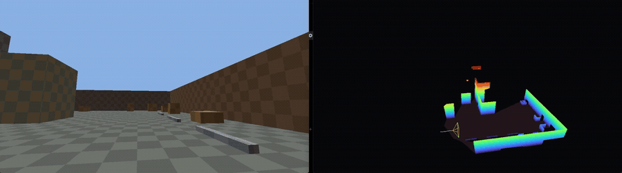
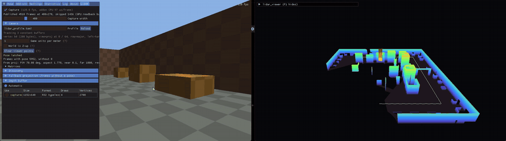

# Game-Lidar: a 3D lidar scanner for any\* game

**Scan your game just by playing it.** A ReShade addon streams the game's depth buffer and camera,
and the viewer turns that stream into a live, lidar-style 3D point cloud.

**Supports ReShade 6.8.0 and DirectX 9, 11 and 12.**

<sub>\*Single-player games that render through DirectX 9, 11 or 12. See
[Before you start](#use-it-in-a-game).</sub>



<sub>A game (left) being scanned live into the viewer (right), starting from nothing.
[MP4](docs/media/hero.mp4)</sub>

- **Fly through your scan** with a free camera. The viewer is its own app, so you can explore while you
  play, with the game paused, or after you've closed it.
- **See the level from above.** Get a bird's-eye view of a map, see how areas connect, and find
  the places you haven't been yet.
- **Follow yourself** through the scan in third person, with a trail of where you've walked.
- **"Attach to camera"** offers a look through the main game's camera, and lets you experience the game through lidar.
- **Scan in the game's own colors**, or color by height to read the terrain.
- **Export to `.ply`** for Blender, MeshLab, CloudCompare and friends.

> [!IMPORTANT]
> **game-lidar is a tool, not a one-click mod.** Every game stores its depth and camera
> differently, so each game needs a few minutes of setup the first time: checking the depth
> buffer, running camera discovery, and tuning settings. Until then, scans come out poor or
> scrambled. Once it looks right, save the profile and the game is set up automatically from then
> on.

## Features
- **Live world-space scans.** Every frame is placed using the game's own camera, so the level's scan
  builds up as you move through it.
- **Camera discovery.** No profile for your game yet? Walk around for about 20 seconds and the
  addon ranks the likely camera matrices for you to try and save.
- **Self-cleaning.** Points left behind by things that moved (NPCs, doors) are carved away when you
  look through where they were.
- **D3D9, D3D11 and D3D12**, 32- and 64-bit games. Tested in D3D9 and D3D11 games; D3D12 is
  untested.

## How it works
```
game ── ReShade ── lidar_capture addon ──▶ shared memory ──▶ lidar_viewer
                   (depth + camera)                          (point cloud)
```
- **The addon** runs inside the game through [ReShade](https://reshade.me). Each frame, it copies a
  downsampled depth buffer without stalling the game and pairs it with the camera matrices it
  reads from the game's shader constants.
- **The viewer** is a separate app. It turns each depth frame into world-space points on the GPU
  and merges them into one cloud.

<p align="center">
  
</p>
<p align="center"><sub>The LiDAR tab in the ReShade overlay: capture stats, the camera, and the
depth buffer in use. <b>Clear viewer points</b> wipes the scan from inside the game.
<a href="docs/media/addon_overlay.mp4">MP4</a></sub></p>

## Use it in a game
**Before you start:**
- **Single-player games only.** Anti-cheat may block ReShade or ban you for using it.
- **Turn off MSAA** in the game's video settings: multisampled depth can't be captured. Post-process
  AA (FXAA, TAA, SMAA) is fine. The LiDAR tab warns when MSAA is getting in the way.
- OpenGL, Vulkan and D3D10 aren't supported. The addon stays inactive and the game runs normally.

**Setup:**
1. **Install [ReShade 6.8.0 with add-on support](https://reshade.me/downloads/ReShade_Setup_6.8.0_Addon.exe)**
   (the "with full add-on support" download). The
   version has to match: ReShade refuses add-ons built for another version. In the installer,
   pick the game's executable and **DirectX 10/11/12** (or **Direct3D 9** for a D3D9 game).
   You can skip all the effects. Not sure which API the game uses? After the first launch,
   `ReShade.log` next to the exe names it (`D3D11CreateDevice`, `IDirect3D9::CreateDevice`, ...).
   Older games can be D3D9 even on a modern system (e.g. Unreal Engine 3 titles).
2. **Copy the addon next to the game's executable**, in the folder where ReShade put `dxgi.dll` /
   `d3d9.dll`: `lidar_capture.addon64` for 64-bit games, `lidar_capture.addon32` for 32-bit ones.
   Some games keep the exe in a subfolder (e.g. `bin\x64\` or `Binaries\Win64\`).
3. **Start the game** and press **Home** to open the ReShade overlay. The **Add-ons** tab should list
   "game-lidar capture", and there's a new **LiDAR** tab. If not, check `ReShade.log` next to the exe.
4. **Start the viewer** (`lidar_viewer.exe`), before or after the game.
5. **Check the depth buffer.** In the LiDAR tab, the buffer marked *captured* should be the scene
   depth (screen-sized, with the most draws). The automatic choice is usually right; pick another
   by hand if not.
6. **Find the camera with Discovery.** Every game keeps its camera matrices in different shader
   constants (registers), so the addon has to find them. Run Discovery (below) and try candidates
   until the scan lines up with itself in the viewer.
7. **Save the profile** once the scan looks right. The next time you start the game it loads
   automatically, so discovery is a one-time step.

### Profiles and discovery
A profile tells the addon where the game keeps its camera. Without one, the viewer can't build up
a map: it only shows what's on screen right now, relative to the camera (set **Fallback
projection** to the game's FOV and near/far for that).

To find the camera, open **Discovery** in the LiDAR tab, press **Start**, then move and turn the
camera for about 20 seconds (in game, not in a menu or cutscene). Candidates are ranked by how
camera-like they behave and how well they line up consecutive depth frames; good ones score in
green. **Use** previews a candidate in the viewer: turn 360° in place, and the level should line up
with itself. **Save** writes it to `lidar_profile.toml` next to the exe. **Write report** saves
everything discovery found to `lidar_discovery.txt`. Not every game will have registers with a very high score. You can still click and "use" through them to find it on your own from there. 

Discovery handles separate view and projection matrices, a combined view-projection, and
per-object world·view·proj matrices. The profile format is described in
[spec.md §3.7](spec.md), with examples in [profiles/](profiles/).

**D3D9 games:** depth is 24-bit, and there are no constant buffers, so a D3D9 profile uses
`slot = 0` and byte offsets of register × 16 (c4 = 64). Games that use the fixed-function pipeline
(mostly pre-2004) have no shader constants to find.

### Settings
Everything is in the LiDAR tab and saved under `[LIDAR]` in the game's `ReShade.ini`.

- **HUD in the colors?** Crop it out under **Color crop (HUD)**. Only the area inside the on-screen
  outline keeps its color; depth still covers the whole screen. Mixed results. It's there if you want it. Otherwise, keep the GUI and fool around with settings to get the best result.
- **Unattended discovery:** set `DiscoveryAutoStart=1`, `DiscoveryAutoSave=<seconds>` and
  `DiscoverySamples` in the ini.

Only edit the ini while the game is closed, because ReShade overwrites it with its in-memory
settings.

**To uninstall**, uninstall ReShade with its installer, then delete the addon file.

## Viewer
| Input | Action |
|---|---|
| Right-drag | Look around |
| WASD / Q E | Move / down, up (Shift: faster, wheel: base speed) |
| `F` | Follow the player (right-drag orbits around them, wheel zooms, `R` resets the view) |
| `H` | Color by height / captured color (the game's scene colors, D3D9 and D3D11) |
| `T` | Show the player's trail |
| `M` | Toggle carving |
| `U` | Hide points above the player's camera (offset, and level or following the camera's up, in the panel) |
| `O` | Hide points between your view and the player's camera, down to a base level with the player's camera (radius, and an offset that slides the base toward you, in the panel) |
| `+` / `-` | Point size |
| `C` | Clear the scan |
| `P` | Save a `.ply` to `scans/` |
| `Space` | Pause |
| `F1` | Hide the UI |

Command-line options: `--voxel 0.1` (point spacing in meters), `--capacity-m 50` (millions of
points; about 1.5 GB of GPU memory at 50), `--near-cut 0.3`, `--max-range 500`,
`--height-range -1 20`, `--no-carve`, `--carve-margin 0.15`, `--carve-rel 0.02`,
`--color-update first|closest|latest` (which sighting's color a point keeps; default closest, so
an effect that tinted a wall from afar is replaced once you get nearer).

## Build
Windows only. Requires Visual Studio 2022 or 2026 with the C++ workload (it bundles CMake). There
are no other dependencies. Run from PowerShell or a Developer prompt (Git Bash confuses MSBuild).

```powershell
cmake -S . -B build -G "Visual Studio 18 2026" -A x64
cmake --build build --config Release
```

The viewer and the 64-bit addon land in `build\bin\Release\`. For 32-bit games, build the addon
separately:
```powershell
cmake -S . -B build-win32 -G "Visual Studio 18 2026" -A Win32
cmake --build build-win32 --config Release --target lidar_capture
```

The addon is built against ReShade 6.8.0. To use a newer ReShade, bump the ReShade tag and the
ImGui commit in `CMakeLists.txt` and rebuild.

## Development
| Path | What |
|---|---|
| [`addon/`](addon/) | The ReShade addon: depth capture, camera tracking, discovery, per-API backends |
| [`viewer/`](viewer/) | The point-cloud viewer |
| [`common/`](common/) | The shared-memory frame protocol between them |
| [`tests/`](tests/), [`tools/`](tools/) | Unit tests, a verification tool, and a test game for checking the addon |

[docs/development.md](docs/development.md) covers the architecture, debugging the addon in a game,
and testing.

## License
game-lidar is licensed under the [GNU General Public License v3.0](LICENSE). You can use, modify
and share it, but if you distribute a modified version, you have to release its source under the
same license.
